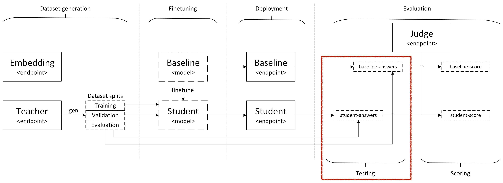
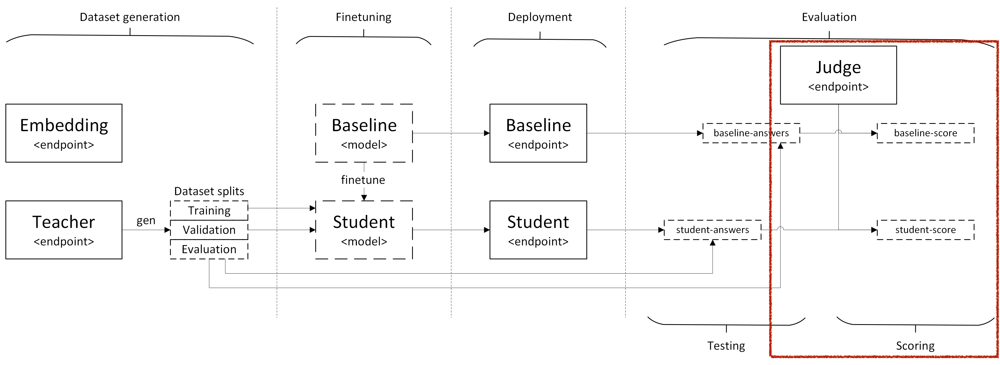

# Evaluation of the student and baseline models with the RAFT generated eval dataset split

In this notebook, we will use the evaluation dataset synthetically generated in the [](./1_gen.ipynb) notebook using the RAFT method to evaluate both the baseline model and the student model, then compare the two to analyse the impact of the fine-tuning.

We introduce the `promptflow-evals` package and built-in evaluators. Then, we'll demonstrate how to use the `evaluate` API to assess data using these evaluators.

Finally, we'll draw a diagram showing the performance of the student model against the baseline.

## Overview

- Testing
  - Run the baseline model on the evaluation split to get its predictions.
  - Run the student model on the evaluation split to get its predictions.
- Answers formatting
  - Convert the baseline model answers to a format suitable for testing
  - Convert the student model answers to a format suitable for testing
- Evaluation
  - Calculate the metrics (such as accuracy, precision, recall, etc.) based on the predictions from the baseline model.
  - Calculate the metrics based on the predictions from the student model.  
- Compare metrics

## Overview


## Installing requirements

The requirements should have been automatically installed if you opened the project in Dev Container or Codespaces, but if not, uncomment the following cell to install the requirements


```python
#! pip install openai azure-ai-evaluation azure-identity promptflow-azure
```

## Running time and cost

The RAFT evaluation script usually takes a few minutes on the default sample document but can take days on bigger domains depending on the number and size of documents and the number of questions being generated for each chunk.

The cost of running this RAFT script on the sample document should be a few dollars. But beware, running it on bigger domains can cost hundreds of dollars if not more.

## Testing

### Overview



### Define variables we will need


```python
import os
from dotenv import load_dotenv

# User provided values
load_dotenv(".env")

# Variables passed by previous notebooks
load_dotenv(".env.state")

# Let's capture the initial working directory because the evaluate function will change it
dir = os.getcwd()

experiment_name = os.getenv("DATASET_NAME")
experiment_dir = f"{dir}/dataset/{experiment_name}-files"

# Dataset generated by the gen notebook that we will evaluate the baseline and student models on
dataset_path_hf_eval = f"{experiment_dir}/{experiment_name}-hf.eval.jsonl"

# Evaluated answer files
dataset_path_hf_eval_answer = f"{experiment_dir}/{experiment_name}-hf.eval.answer.jsonl"
dataset_path_hf_eval_answer_baseline = f"{experiment_dir}/{experiment_name}-hf.eval.answer.baseline.jsonl"

# Formatted answer evaluation files
dataset_path_eval_answer_student = f"{experiment_dir}/{experiment_name}-eval.answer.student.jsonl"
dataset_path_eval_answer_baseline = f"{experiment_dir}/{experiment_name}-eval.answer.baseline.jsonl"

# Scored answer files
dataset_path_eval_answer_score_student = f"{experiment_dir}/{experiment_name}-eval.answer.score.student.jsonl"
dataset_path_eval_answer_score_baseline = f"{experiment_dir}/{experiment_name}-eval.answer.score.baseline.jsonl"

# Scored answer metrics files
dataset_path_eval_answer_score_metrics_student = f"{experiment_dir}/{experiment_name}-eval.answer.score.metrics.student.jsonl"
dataset_path_eval_answer_score_metrics_baseline = f"{experiment_dir}/{experiment_name}-eval.answer.score.metrics.baseline.jsonl"

BASELINE_OPENAI_DEPLOYMENT = os.getenv("BASELINE_OPENAI_DEPLOYMENT")
BASELINE_MODEL_API = os.getenv("BASELINE_MODEL_API")

STUDENT_DEPLOYMENT_NAME = os.getenv("STUDENT_DEPLOYMENT_NAME")
STUDENT_MODEL_API = os.getenv("STUDENT_MODEL_API")

print(f"Evaluating the student {STUDENT_MODEL_API} model {STUDENT_DEPLOYMENT_NAME} against the baseline {BASELINE_MODEL_API} model {BASELINE_OPENAI_DEPLOYMENT}")
```

### Run the baseline model on the evaluation split


```python
! [ ! -f $dataset_path_hf_eval_answer_baseline ] && env $(cat .env .env.state) python .gorilla/raft/eval.py \
    --question-file $dataset_path_hf_eval \
    --answer-file $dataset_path_hf_eval_answer_baseline \
    --model $BASELINE_OPENAI_DEPLOYMENT \
    --env-prefix BASELINE \
    --mode $BASELINE_MODEL_API \
    || echo "Baseline answers file already exists, skipping."
```

### Format baseline answers

Convert the baseline model answers to a format suitable for testing


```python
! python .gorilla/raft/format.py \
    --input $dataset_path_hf_eval_answer_baseline \
    --input-type jsonl \
    --output $dataset_path_eval_answer_baseline \
    --output-format eval
```


```python
from utils import pretty_print_row
import pandas as pd
pretty_print_row(pd.read_json(dataset_path_eval_answer_baseline, lines=True), 0)
```

### Run the student model on the evaluation split


```python
! [ ! -f $dataset_path_hf_eval_answer ] && env $(cat .env .env.state) python .gorilla/raft/eval.py \
    --question-file $dataset_path_hf_eval \
    --answer-file $dataset_path_hf_eval_answer \
    --model $STUDENT_DEPLOYMENT_NAME \
    --env-prefix STUDENT \
    --mode $STUDENT_MODEL_API \
    || echo "Student answers file already exists, skipping."
```


```python
import pandas as pd
pd.read_json(dataset_path_hf_eval_answer, lines=True).head(2)
```

### Format student model answers

Convert the student model answers to a format suitable for testing


```python
! python .gorilla/raft/format.py \
    --input $dataset_path_hf_eval_answer \
    --input-type jsonl \
    --output $dataset_path_eval_answer_student \
    --output-format eval
```

### Student model answers


```python
from utils import pretty_print_row
import pandas as pd
pretty_print_row(pd.read_json(dataset_path_eval_answer_student, lines=True), 0)
```

## Evaluation

### Overview


### Built-in Evaluators

The table below lists all the built-in evaluators we support. In the following sections, we will select a few of these evaluators to demonstrate how to use them.

| Category       | Namespace                                        | Evaluator Class           | Notes                                             |
|----------------|--------------------------------------------------|---------------------------|---------------------------------------------------|
| Quality        | promptflow.evals.evaluators                      | GroundednessEvaluator     | Measures how well the answer is entailed by the context and is not hallucinated |
|                |                                                  | RelevanceEvaluator        | How well the answer addresses the main aspects of the question, based on the context. Consider whether all and only the important aspects are contained in the answer when evaluating relevance. |
|                |                                                  | CoherenceEvaluator        | How well all the sentences fit together and sound naturally as a whole. |
|                |                                                  | FluencyEvaluator          | Quality of individual sentences in the answer, and whether they are well-written and grammatically correct. |
|                |                                                  | SimilarityEvaluator       | Measures the similarity between the predicted answer and the correct answer |
|                |                                                  | F1ScoreEvaluator          | F1 score |
| Content Safety | promptflow.evals.evaluators.content_safety       | ViolenceEvaluator         |                                                   |
|                |                                                  | SexualEvaluator           |                                                   |
|                |                                                  | SelfHarmEvaluator         |                                                   |
|                |                                                  | HateUnfairnessEvaluator   |                                                   |
| Composite      | promptflow.evals.evaluators                      | QAEvaluator               | Built on top of individual quality evaluators.    |
|                |                                                  | ChatEvaluator             | Similar to QAEvaluator but designed for evaluating chat messages. |
|                |                                                  | ContentSafetyEvaluator    | Built on top of individual content safety evaluators. |


#### Quality Evaluator


```python
import os
from azure.ai.evaluation import OpenAIModelConfiguration, AzureOpenAIModelConfiguration

openai_base_url = os.environ.get("JUDGE_OPENAI_BASE_URL")
azure_endpoint = os.environ.get("JUDGE_AZURE_OPENAI_ENDPOINT")

if openai_base_url:
    openai_api_key = os.environ.get("JUDGE_OPENAI_API_KEY")
    model = os.environ.get(f"JUDGE_OPENAI_DEPLOYMENT")

    print(f"openai_base_url={openai_base_url}")
    print(f"model={model}")

    # Initialize OpenAI Connection
    model_config = OpenAIModelConfiguration(
        base_url=openai_base_url,
        api_key=openai_api_key,
        model=model
    )
    model_config.api_version = None

elif azure_endpoint:
    azure_deployment = os.environ.get("JUDGE_AZURE_OPENAI_DEPLOYMENT")
    api_key = os.environ.get("JUDGE_AZURE_OPENAI_API_KEY")
    api_version = os.environ.get("JUDGE_OPENAI_API_VERSION")

    print(f"azure_endpoint={azure_endpoint}")
    print(f"azure_deployment={azure_deployment}")
    print(f"api_version={api_version}")

    args = {
        'azure_endpoint': azure_endpoint,
        'azure_deployment': azure_deployment,
        'api_version': api_version,
    }
    if api_key:
        args['api_key'] = api_key

    # Initialize Azure OpenAI Connection
    model_config = AzureOpenAIModelConfiguration(args)

else:
    print("Couldn't find a judge endpoint environment variable")
```


```python
from azure.ai.evaluation import CoherenceEvaluator, F1ScoreEvaluator, FluencyEvaluator, GroundednessEvaluator, RelevanceEvaluator, SimilarityEvaluator, BleuScoreEvaluator, RougeScoreEvaluator, RougeType

explanations = {
    "groundedness": "Measures how well the answer is entailed by the context and is not hallucinated",
    "relevance": "How well the answer addresses the main aspects of the question, based on the context. Consider whether all and only the important aspects are contained in the answer when evaluating relevance.",
    "coherence": "How well all the sentences fit together and sound naturally as a whole.",
    "fluency": "Quality of individual sentences in the answer, and whether they are well-written and grammatically correct.",
    "similarity": "Measures the similarity between the predicted answer and the correct answer",
    "f1_score": "Measures the overlap between the predicted answer and the correct answer",
}

# Initializing evaluators
evaluators = {

    # GPT based metrics
    "coherence" : CoherenceEvaluator(model_config),
    "f1_score" : F1ScoreEvaluator(),
    "fluency" : FluencyEvaluator(model_config),
    "groundedness" : GroundednessEvaluator(model_config),
    "relevance" : RelevanceEvaluator(model_config),
    "similarity" : SimilarityEvaluator(model_config),

    # Math metrics
    "bleu" : BleuScoreEvaluator(),
    "rouge_1" : RougeScoreEvaluator(RougeType.ROUGE_1),
    "rouge_2" : RougeScoreEvaluator(RougeType.ROUGE_2),

#    "qa" : QAEvaluator(model_config),
#    "chat" : ChatEvaluator(model_config),

#    "violence" : ViolenceEvaluator(model_config),
#    "sexual" : SexualEvaluator(model_config),
#    "self_harm" : SelfHarmEvaluator(model_config),
#    "hate_unfairness" : HateUnfairnessEvaluator(model_config),

#    "content_safety" : ContentSafetyEvaluator(model_config),
#    "content_safety_chat" : ContentSafetyChatEvaluator(model_config),
}
```

### Run metrics on a student model answer


```python
df = pd.read_json(dataset_path_eval_answer_student, lines=True)
pretty_print_row(df, 1)
```


```python
sample = df.iloc[1]

# Running similarity Evaluator on single input row
similarity_score = evaluators["similarity"](
    query=sample["question"],
    response=sample["final_answer"],
    context=sample["context"],
    ground_truth=sample["gold_final_answer"],
)
print(similarity_score)
```

### Using the Evaluate API to calculate the metrics in bulk

In previous sections, we walked you through how to use built-in evaluators to evaluate a single row and how to define your own custom evaluators. Now, we will show you how to use these evaluators with the powerful `evaluate` API to assess an entire dataset.

### Running the metrics

Now, we will invoke the `evaluate` API using a few evaluators that we already initialized

Additionally, we have a column mapping to map the `truth` column from the dataset to `ground_truth`, which is accepted by the evaluator.


```python
from azure.ai.evaluation import evaluate

def score_dataset(dataset, rows_output_path=None, metrics_output_path=None):
    result = evaluate(
        data=dataset,
        evaluators=evaluators,
        # column mapping
        evaluator_config={
            "default": {
                "column_mapping": {
                    "query": "${data.question}",
                    "response": "${data.final_answer}",
                    "ground_truth": "${data.gold_final_answer}",
                    "context": "${data.context}",
                }
            }
        },
    )

    if rows_output_path:
        pd.DataFrame.from_dict(result["rows"]).to_json(rows_output_path, orient="records", lines=True)

    #if metrics_output_path:
    #    pd.DataFrame.from_dict(result["metrics"]).to_json(metrics_output_path, orient="records", lines=True)

    return result
```

#### Baseline model evaluation metrics


```python
pd.read_json(dataset_path_eval_answer_baseline, lines=True).head(2)
```


```python
baseline_result = score_dataset(dataset_path_eval_answer_baseline, dataset_path_eval_answer_score_baseline, dataset_path_eval_answer_score_metrics_baseline)
from IPython.display import display, JSON

display(JSON(baseline_result["metrics"]))
```


```python
# Check the results using Azure AI Studio UI
studio_url = baseline_result["studio_url"] or "http://127.0.0.1:23333"
print(f"Results available at {studio_url}")
```

#### Student model evaluation metrics


```python
pd.read_json(dataset_path_eval_answer_student, lines=True).head(2)
```


```python
student_result = score_dataset(dataset_path_eval_answer_student, dataset_path_eval_answer_score_student, dataset_path_eval_answer_score_metrics_student)
from IPython.display import display, JSON

display(JSON(student_result["metrics"]))
```


Finally, let's check the results produced by the evaluate API.


```python
# Check the results using Azure AI Studio UI
studio_url = student_result["studio_url"] or "http://127.0.0.1:23333"
print(f"Results available at {studio_url}")
```

## Let's look at examples


```python
df_baseline=pd.read_json(dataset_path_eval_answer_score_baseline, lines=True)
df_student=pd.read_json(dataset_path_eval_answer_score_student, lines=True)
df_merged=pd.merge(df_baseline, df_student, on="inputs.question", suffixes=('_baseline', '_student'))
df_merged.insert(0, "id", df_merged.index)
df_merged.head(2)
```

## Compare the metrics of the student model against the baseline


```python
metrics = pd.DataFrame.from_dict({"baseline": baseline_result["metrics"], "student": student_result["metrics"]})
metrics["improvement"] = (metrics["student"] - metrics["baseline"]) / metrics["baseline"]
gpt_metric_names = set(filter(lambda e: 'gpt' in e, metrics.index.values))
gpt_mask = metrics.index.isin(gpt_metric_names)
metrics_gpt = metrics[gpt_mask] # between 1 and 5
metrics_math = metrics[~gpt_mask] # between 0 and 1
```


```python
metrics_math
```


```python
import matplotlib.pyplot as plt

#define subplot layout
fig, axes = plt.subplots(nrows=2, ncols=1, figsize=(7, 7))
axes[0].set_title('Math metrics')
metrics_math.drop("improvement", axis=1).plot.barh(rot=0, colormap='Dark2', ax=axes[0])
axes[1].set_title('GPT metrics')
metrics_gpt.drop("improvement", axis=1).plot.barh(rot=0, colormap='Dark2', ax=axes[1])

```


```python
import matplotlib.pyplot as plt

#define subplot layout
fig, axes = plt.subplots(nrows=2, ncols=1, figsize=(7, 7))
axes[0].set_title('Math metrics')
metrics_math["improvement"].plot.barh(rot=0, ax=axes[0], color=(metrics_math["improvement"] > 0).map({True: 'g', False: 'r'}))
axes[1].set_title('GPT metrics')
metrics_gpt["improvement"].plot.barh(rot=0, ax=axes[1], color=(metrics_gpt["improvement"] > 0).map({True: 'g', False: 'r'}))

```

## Let's look at outliers

### Compute improvement for each sample and metric


```python
suffixes=[column.replace("_baseline", "").replace("outputs.", "") for column in df_merged.columns if column.startswith("outputs.") and column.endswith("_baseline")]
```


```python
df_improvements = df_merged.copy()
for suffixe in suffixes:
    df_improvements[f"improvement_outputs.{suffixe}"] = (df_improvements[f"outputs.{suffixe}_student"] - df_improvements[f"outputs.{suffixe}_baseline"]) / df_improvements[f"outputs.{suffixe}_baseline"]
df_improvements.head()
```

### Find samples for the worst GPT Fluency


```python
sort_columns=['improvement_outputs.fluency.gpt_fluency']
display_columns=["id", "inputs.question", "inputs.final_answer_baseline", "inputs.final_answer_student", "improvement_outputs.fluency.gpt_fluency", "inputs.gold_final_answer_student"]
df_improvements.sort_values(by=sort_columns, ascending=True)[display_columns].head(3)
```

### Find samples for the best GPT Fluency


```python
df_improvements.sort_values(by=sort_columns, ascending=False)[display_columns].head(3)
```


```python

```
